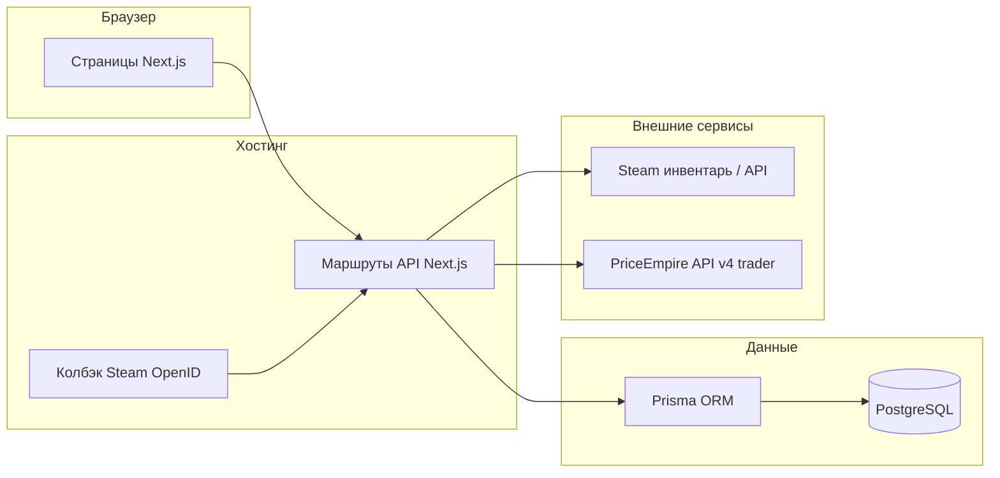

# План реализации MVP обменника CS2 (ручной трейд)

## Ответ на вопрос про инфраструктуру

Да — такой формат нормален: репозиторий, деплой, БД и домен остаются на ваших аккаунтах, а разработчик пошагово ведёт через создание сервисов, выдаёт список переменных окружения, проверяет билд и даёт короткую «шпаргалку» по эксплуатации (где смотреть логи, как откатить деплой, как сделать бэкап БД). Технически вы не обязаны «разбираться глубоко» — достаточно пройти чеклисты один раз.

---

## Цели MVP (границы)

- Вход через **Steam OpenID** → в БД сохраняется `steamId`, аватар/ник (по желанию обновлять при логине).
- **Два инвентаря** на странице трейда: **ваш** (фиксированный `ownerSteamId`, загрузка через **серверный** Steam Web API Key — в т.ч. предметы в трейдлоке) и **гостя** (только после сохранённой **trade-ссылки** `partner`+`token`, без API-ключей у пользователей и без опоры на URL профиля `…/inventory/` как основной способ); выбор предметов, суммы, создание **заявки** без автоматического обмена в Steam.
- **Админка**: список заявок, смена статуса, просмотр состава и пользователей — без сложных ролей и аналитики.
- **Цены**: **PriceEmpire** (см. [доку](https://pricempire.com/docs#get-v4-trader-items-prices)); **фоновое обновление** в **PostgreSQL** с учётом **лимита тарифа** (ориентир **≤100/сутки** или **≤1000/мес** — уточнить у PriceEmpire). **Переключатель провайдера** в админке **в границах API/тарифа**. По умолчанию **Buff163 (starting at / min)**. Учёт **фаз Doppler/Gamma Doppler** (Phase 1–4, Emerald, …): **разные цены** для разных фаз при одном базовом названии; на карточке — **видимая подпись фазы**. **Две внутренние наценки** (% гостя / % владельца) без бейджа «% к рынку» гостю. **Ручные цены** по **`assetId`** до сброса.
- **Кэш** инвентарей + уважение к **лимитам Steam**; **лимиты PriceEmpire** — учитывать тариф (см. [subscribe](https://pricempire.com/subscribe)).
- **UI инвентаря (референс sargee.trade):** трейдлок с таймером, предметы в блокировке **нельзя** добавить в обмен; наклейки — маленькие иконки; центральная колонка — **полный набор** типов предметов и фильтров как у референса + поиск и сортировка.
- **Адаптив** под телефон/планшет как полноценное использование, не «не ломается».

Вне MVP (явно отложить): боты, автотрейд, вебсокеты (достаточно **периодического опроса** статуса заявки), мультивалютная аналитика, сложные роли.

---

## Рекомендуемая архитектура

- **Вся бизнес-логика на сервере**: фронт только отображает и шлёт «что выбрано»; сервер пересчитывает стоимость и валидирует предметы (защита от подмены JSON).
- **Секреты** (Steam Web API **только для владельца** на сервере; **PriceEmpire API key**; `SESSION_SECRET`; URL колбэка OpenID) только в переменных окружения на хостинге, не в репозитории. **Смена ключей:** панель хостинга → Environment → обновить переменную → перезапуск/деплой. Расписание **cron** для часового прайса: Render Cron / внешний ping секретного URL / аналог.

---

## Модель данных (Prisma, черновик сущностей)

- **User** — `steamId` (уникальный), `displayName`, `avatarUrl`, `createdAt`, `updatedAt`, `lastLoginAt` (обновляется при успешном входе через Steam), флаг `isAdmin` для админки, флаг **`isBanned`** (или аналог) — забаненный пользователь не допускается к защищённым маршрутам после проверки сессии. К этапу 4: сохранённая **trade-ссылка** гостя (целиком или нормализованные `partner` + `token` после валидации), время последней проверки; детали хранения — по согласованию (без лишних секретов в логах).
- **Trade** — `id`, `creatorSteamId`, `status` (enum: например `pending`, `accepted_by_admin`, `completed`, `cancelled`), `createdAt`, `updatedAt`, опционально `notes` (для админа).
- **TradeSide** или вложенные записи: для каждой стороны — список выбранных предметов как **снимок** (JSON или отдельная таблица **TradeItem**): `marketHashName`, **`phaseLabel`** (Phase 1–4, Emerald, … или пусто), `assetId` (на момент заявки), `classId`, `instanceId`, `wear`/`float` если есть, `priceUsd` (на момент создания), `quantity`.
- **PriceCatalogItem** (или **PriceCache**) — ключ **`marketHashName` + нормализованная фаза** (или отдельное поле `phaseKey`, для не-допплеров — `null` / `default`); цена по активному провайдеру, `updatedAt`, опционально сырой JSON; заполняется **фоновым job** с маппингом ответа PriceEmpire на фазы (если API отдаёт раздельно) или постобработкой.
- **PricingSettings** — `selectedPriceProvider` (ключ/enum под маппинг на PriceEmpire), `markupGuestPercent`, `markupOwnerPercent` (в т.ч. отрицательные); одна запись + UI на **одной админ-странице** «Настройки цен».
- **OwnerManualPrice** — **строго** `ownerSteamId` + **`assetId`** + `priceUsd`, активен до сброса; два физически разных предмета с одним `market_hash_name` — две строки при необходимости.
- **InventoryCache** — для гостя: привязка к пользователю + `appId` 730 + (опционально) хэш/идентификатор сохранённой trade-ссылки; для владельца: отдельный ключ кэша по `ownerSteamId` + 730 → сырой/нормализованный JSON + `fetchedAt`.

Важно: хранить **снимок** предметов и цен в заявке, чтобы история не «плыла» при обновлении кэша.

---

## Этапы работ (порядок выполнения)

### Фаза 0 — Инфраструктура и аккаунты (1–2 сессии)

Цель: пустой репозиторий, пустая БД, пустой деплой, домен указывает на продакшен.

1. **GitHub**: новый репозиторий, ветка `main`, защита ветки по желанию, `.gitignore` для Node/Next и файлов `.env*`.
2. **PostgreSQL**: managed-БД (удобные варианты — Neon, Supabase, Railway, Render PostgreSQL). Сохранить `DATABASE_URL`.
3. **Хостинг приложения** (типичный выбор для Next.js):
  - **Vercel** + внешняя PostgreSQL — минимум возни с билдом; OpenID callback настроить на прод-домен.
  - Альтернатива: **Render** / **Railway** / VPS с Docker — если нужен один биллинг или особые требования.
4. **Домен**: регистратор (Namecheap, Cloudflare Registrar и т.д.) → DNS: A/CNAME на хостинг; для Vercel — привязка домена в панели и SSL автоматически.
5. **Переменные окружения** на проде: `DATABASE_URL`, `NEXTAUTH_SECRET` или аналог для сессий, Steam OpenID realm/return URL, ключи цен, `OWNER_STEAM_ID` (ваш SteamID64 для «второй стороны»).

Чеклист для вас как заказчика: иметь отдельный email для сервисов, двухфакторная аутентификация на GitHub, сохранить пароли и строку подключения к БД в менеджере паролей.

---

### Фаза 1 — Каркас Next.js + Prisma (0.5–1 неделя)

- Инициализация Next.js (App Router), TypeScript, ESLint.
- Prisma schema, миграции, `prisma generate`.
- Базовый макет страниц, маршрут проверки работоспособности (`/api/health`).
- Локальный `.env.example` без секретов.

---

### Фаза 2 — Авторизация Steam OpenID (критичный блок)

- Реализация **Steam OpenID 2.0** на сервере (проверенная библиотека или ручная валидация согласно спецификации Valve): эндпоинты `login` и `callback`.
- После валидации — создать/обновить **User**, выдать **сессию** (зашифрованная cookie или JWT в httpOnly-cookie; для MVP удобна сессия в cookie с возможностью отзыва на сервере). При успешном входе обновлять **`lastLoginAt`** (для отображения в админке на этапе 7).
- Страница «Выйти», защита админ-роутов; для уже авторизованных запросов проверять **`isBanned`** и при бане завершать сессию / отказывать в доступе.

Нюансы: URL возврата после OpenID должен **точно** совпадать с зарегистрированным; для продакшена и превью-деплоев иногда нужны отдельные переменные окружения или один канонический базовый URL приложения.

---

### Фаза 3 — Инвентари CS2 (730)

**Принцип:** гость **не отдаёт Steam Web API Key**. Он вставляет **trade-ссылку** (`…/tradeoffer/new/?partner=…&token=…`); сервер проверяет формат, сохраняет в профиле пользователя и **только после этого** запрашивает инвентарь гостя по согласованной серверной схеме (опора на `partner` + `token`, **не** на основной сценарий «открыть инвентарь по ссылке профиля `…/id/…/inventory/`», чтобы уменьшить влияние лимитов Steam на такой тип обращений). Нет токена/ссылки — кнопка «показать инвентарь» недоступна или показывает подсказку.

**Владелец сайта:** инвентарь (включая предметы в **трейдлоке**, невидимые гостю через обычный просмотр) — **только сервером** через **ваш** Steam Web API Key из переменной окружения (Render и т.д.). Ключ **не** передаётся на клиент и **не** используется для чужих аккаунтов. Ротация ключа: только смена env на хостинге, без релиза кода.

- **Нормализация** предмета для UI: иконка, название, редкость, wear, **float**, **фаза** (Phase 1–4, Emerald, Sapphire и т.д. — парсинг из описаний Steam / тегов; для Gamma Doppler и аналогов **обязательна** метка на карточке), наклейки (**иконки**), `market_hash_name` + фаза для **ценообразования**; поля **трейдлока** — для отображения и **запрета в обмен**.
- **Кэш** инвентаря: TTL 2–5 минут (настраиваемо) + ручной «Обновить» с rate limit на пользователя/IP.
- **Фильтры/сортировка** — **полный набор как у референса** (все типы; float, редкость, wear, качество; при необходимости фильтр/группировка по **фазе** для ножей Doppler-линейки; поиск; сортировка по цене / имени) по загруженному инвентарю.
- **API:** например `GET /api/inventory/me` — только свой инвентарь после входа и (для гостя) после валидной trade-ссылки; инвентарь владельца — по `OWNER_STEAM_ID` + серверный Steam ключ — без утечки чужих данных.

---

### Фаза 4 — Цены (PriceEmpire + правила сайта)

- **PriceEmpire**, ключ в **env** (`PRICEMPIRE_API_KEY`). Эндпоинт и параметры — по [документации](https://pricempire.com/docs#get-v4-trader-items-prices) (для v4/trader в примере — `app_id=730`, `sources` **buff163** / **skins**); другие площадки из UI (Steam, Skinport, …) подключаются **если** доступны в API на тарифе заказчика (маппинг в коде).
- **PriceSyncJob:** учёт **реального числа запросов** на полное обновление каталога; расписание и батчи так, чтобы **не выходить за лимит** (целевые ориентиры: **≤100/день** или **≤1000/мес** на выбранном плане — финально по [subscribe](https://pricempire.com/subscribe)). Учёт/лог запросов; UI только из БД.
- **База по умолчанию:** Buff163 в режиме **starting at / minimum** (как в API). **Не использовать** несколько аккаунтов/ключей для обхода лимитов Free.
- **Формула:** цена из БД по ключу **провайдер + `market_hash_name` + фаза** (или согласованный маппинг к полям PriceEmpire) × **(1 + markupGuestPercent / markupOwnerPercent)** по стороне; при **OwnerManualPrice** по **`assetId`** — ручная цена приоритетнее. **Не показывать** гостю «% к рынку» (только USD и **подпись фазы** на карточке).
- **Минимальный порог цены** (настраивается, по умолчанию **~20 USD**): предметы дешевле порога **не ценим** через PriceEmpire — на карточке **размытая картинка** + **«UNAVAILABLE (Price too low)»**; добавить в обмен **нельзя**. Для ваших предметов ниже порога — **ручная цена по `assetId`** снимает блокировку и ставит нужную сумму. Экономит запросы и помогает вписаться в бесплатный/маленький лимит API.
- **Одна админ-страница** (`isAdmin`): провайдер цен, два поля наценок, **порог минимальной цены**, блок ручных цен (`assetId`) + сброс к авто.
- Заявка: сервер пересчитывает цены по правилам выше → **TradeItem** (клиенту не доверять).

---

### Фаза 5 — Страница трейда и заявки

- UI как в референсе: два столбца инвентарей, **центр — полный блок фильтров**; карточки: **итоговая цена USD**, **метка фазы**, трейдлок, наклейки; предметы **в трейдлоке** или **ниже порога цены** (размытые, «UNAVAILABLE (Price too low)») — **не выбираются** для обмена.
- `POST /api/trades` — создание заявки: пользователь авторизован, состав с обеих сторон, пересчёт цен на сервере, статус `pending`.
- `GET /api/trades/me` — список своих заявок; опрос статуса раз в N секунд на детальной странице заявки (опционально).

---

### Фаза 6 — Админка

- Простая защита: флаг `isAdmin` в БД + ручная выдача первому пользователю SQL/скриптом.
- Список заявок, фильтр по статусу, карточка заявки, смена статуса, заметки.
- Раздел **пользователей**: кто входил через Steam (отображение из таблицы `User`), **последний вход** (`lastLoginAt`), без отдельного «лога всех запросов».
- **Бан пользователя**: переключатель или кнопки «забанить / разбанить» (`isBanned`); на уровне сервера — отказ в доступе для забаненной сессии (и при следующем входе через Steam).
- Без графиков, без сложной ролевой модели и без полноценного audit-log действий админа.

---

### Фаза 7 — Адаптив, UX, ошибки

- Сетка 1 колонка на мобильных, 2 на планшете/десктопе; фиксированные зоны «ваши / мои» предметы.
- Состояния загрузки, пустой инвентарь, приватный инвентарь, лимиты Steam, деградация если провайдер цен недоступен (показать «цена недоступна», блокировать отправку или разрешить с предупреждением — зафиксировать политику в MVP).

---

### Фаза 8 — Деплой, мониторинг, передача

- Подключение прод-БД, прогон миграций (`prisma migrate deploy`).
- Проверка OpenID на прод-домене.
- Минимальный мониторинг: логи хостинга, уведомление при падении билда (по желанию — GitHub Actions).
- Короткая документация для вас: где env, как обновить `OWNER_STEAM_ID`, **Steam Web API Key**, **PriceEmpire API key**, как выдать админа, где менять наценки и ручные цены, как смотреть заявки и логи job прайса.

---

## Безопасность (кратко)

- Не доверять клиенту: цены, состав «чужой» стороны для чужих пользователей — только сервер решает, что допустимо.
- Ограничение частоты запросов к API инвентаря и создания заявок (middleware или настройки edge).
- Защита от CSRF для cookie-сессий там, где это требуется выбранным способом хранения сессии.
- Админка только по HTTPS.

---

## Оценка сроков (согласованная в переписке)

Ориентир **2–3 недели** календарных при одном fullstack-разработчике, при условии что своевременно выбран провайдер цен и выданы доступы к GitHub, хостингу, БД и домену.

---

## Риски и меры

- **Приватный инвентарь / недоступность у гостя** — понятное сообщение (в т.ч. проверить trade-ссылку и настройки приватности Steam).
- **Неверная или отозванная trade-ссылка** — валидация при сохранении и при запросе инвентаря, дружелюбная ошибка.
- **Лимиты Steam** — кэш, повтор с задержкой (backoff), кнопка «Обновить» с ограничением частоты; выбранный сценарий (trade-ссылка vs профильный inventory URL) снижает риск по сравнению с массовой проверкой по URL профиля.
- **Расхождение имён предметов и цен** — нормализация `market_hash_name` + **фазы**; логирование и fallback (ручная цена / базовое имя), если PriceEmpire не разделяет фазу в ответе.
- **OpenID на неверном URL** — один канонический `NEXT_PUBLIC_APP_URL`, проверка колбэка перед продакшеном.
- **Лимит запросов PriceEmpire** — мониторинг счётчика; при исчерпании — реже синк или апгрейд тарифа; не дёргать API из браузера; **не** обходить лимит мультиаккаунтами.
- **Пагинация каталога PriceEmpire** — заранее заложить число запросов за цикл и вписать в дневной/месячный бюджет.
- **Ручная цена и смена `assetId`** — при продаже/перемещении предмета в Steam привязка может устареть; политика: сброс или повторное назначение в админке.
