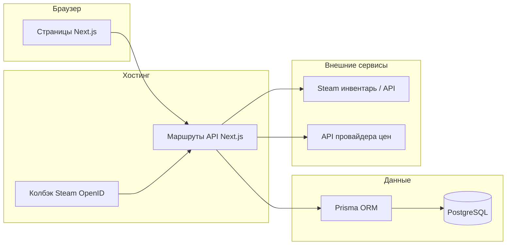

# План реализации MVP обменника CS2 (ручной трейд)

## Ответ на вопрос про инфраструктуру

Да — такой формат нормален: репозиторий, деплой, БД и домен остаются на ваших аккаунтах, а разработчик пошагово ведёт через создание сервисов, выдаёт список переменных окружения, проверяет билд и даёт короткую «шпаргалку» по эксплуатации (где смотреть логи, как откатить деплой, как сделать бэкап БД). Технически вы не обязаны «разбираться глубоко» — достаточно пройти чеклисты один раз.

---

## Цели MVP (границы)

- Вход через **Steam OpenID** → в БД сохраняется `steamId`, аватар/ник (по желанию обновлять при логине).
- **Два инвентаря** на странице трейда: ваш (фиксированный `ownerSteamId` в конфиге/БД) и гостя; выбор предметов, суммы, создание **заявки** без автоматического обмена в Steam.
- **Админка**: список заявок, смена статуса, просмотр состава и пользователей — без сложных ролей и аналитики.
- **Цены**: интеграция с одним выбранным провайдером (при необходимости — запасной источник: данные рынка), с **нормализацией** (валюта, износ wear, StatTrak, market_hash_name).
- **Кэш** инвентарей и цен + уважение к **лимитам Steam** (не дергать инвентарь на каждый клик).
- **Адаптив** под телефон/планшет как полноценное использование, не «не ломается».

Вне MVP (явно отложить): боты, автотрейд, вебсокеты (достаточно **периодического опроса** статуса заявки), мультивалютная аналитика, сложные роли.

---

## Рекомендуемая архитектура

- **Вся бизнес-логика на сервере**: фронт только отображает и шлёт «что выбрано»; сервер пересчитывает стоимость и валидирует предметы (защита от подмены JSON).
- **Секреты** (при необходимости ключ Steam Web API, ключ провайдера цен, `SESSION_SECRET`, URL колбэка OpenID) только в переменных окружения на хостинге, не в репозитории.

---

## Модель данных (Prisma, черновик сущностей)

- **User** — `steamId` (уникальный), `displayName`, `avatarUrl`, `createdAt`, по желанию `isAdmin` (логический флаг) для простой админки.
- **Trade** — `id`, `creatorSteamId`, `status` (enum: например `pending`, `accepted_by_admin`, `completed`, `cancelled`), `createdAt`, `updatedAt`, опционально `notes` (для админа).
- **TradeSide** или вложенные записи: для каждой стороны — список выбранных предметов как **снимок** (JSON или отдельная таблица **TradeItem**): `marketHashName`, `assetId` (на момент заявки), `classId`, `instanceId`, `wear` если есть, `priceUsd` (на момент создания), `quantity`.
- **PriceCache** — ключ предмета → цена, `fetchedAt`, время жизни кэша (TTL) в логике приложения.
- **InventoryCache** — `steamId` + `appId` (730 для CS2) → сырой/нормализованный JSON + `fetchedAt`.

Важно: хранить **снимок** предметов и цен в заявке, чтобы история не «плыла» при обновлении кэша.

---

## Этапы работ (порядок выполнения)

### Фаза 0 — Инфраструктура и аккаунты (1–2 сессии)

Цель: пустой репозиторий, пустая БД, пустой деплой, домен указывает на продакшен.

1. **GitHub**: новый репозиторий, ветка `main`, защита ветки по желанию, `.gitignore` для Node/Next и файлов `.env*`.
2. **PostgreSQL**: managed-БД (удобные варианты — Neon, Supabase, Railway, Render PostgreSQL). Сохранить `DATABASE_URL`.
3. **Хостинг приложения** (типичный выбор для Next.js):
  - **Vercel** + внешняя PostgreSQL — минимум возни с билдом; OpenID callback настроить на прод-домен.
  - Альтернатива: **Render** / **Railway** / VPS с Docker — если нужен один биллинг или особые требования.
4. **Домен**: регистратор (Namecheap, Cloudflare Registrar и т.д.) → DNS: A/CNAME на хостинг; для Vercel — привязка домена в панели и SSL автоматически.
5. **Переменные окружения** на проде: `DATABASE_URL`, `NEXTAUTH_SECRET` или аналог для сессий, Steam OpenID realm/return URL, ключи цен, `OWNER_STEAM_ID` (ваш SteamID64 для «второй стороны»).

Чеклист для вас как заказчика: иметь отдельный email для сервисов, двухфакторная аутентификация на GitHub, сохранить пароли и строку подключения к БД в менеджере паролей.

---

### Фаза 1 — Каркас Next.js + Prisma (0.5–1 неделя)

- Инициализация Next.js (App Router), TypeScript, ESLint.
- Prisma schema, миграции, `prisma generate`.
- Базовый макет страниц, маршрут проверки работоспособности (`/api/health`).
- Локальный `.env.example` без секретов.

---

### Фаза 2 — Авторизация Steam OpenID (критичный блок)

- Реализация **Steam OpenID 2.0** на сервере (проверенная библиотека или ручная валидация согласно спецификации Valve): эндпоинты `login` и `callback`.
- После валидации — создать/обновить **User**, выдать **сессию** (зашифрованная cookie или JWT в httpOnly-cookie; для MVP удобна сессия в cookie с возможностью отзыва на сервере).
- Страница «Выйти», защита админ-роутов.

Нюансы: URL возврата после OpenID должен **точно** совпадать с зарегистрированным; для продакшена и превью-деплоев иногда нужны отдельные переменные окружения или один канонический базовый URL приложения.

---

### Фаза 3 — Инвентари CS2 (730)

- Серверный сервис: запрос инвентаря по `steamId` через актуальные методы Steam (с учётом того, что публичность инвентаря обязательна; иначе — понятная ошибка на UI).
- **Нормализация** предмета для UI: иконка, название, редкость, wear из описаний, `market_hash_name` для цен.
- **Кэш**: TTL 2–5 минут (настраиваемо) + ручной «Обновить» с ограничением частоты запросов на пользователя/IP.
- Эндпоинты вида: `GET /api/inventory?steamId=…` только для **своего** инвентаря после авторизации; инвентарь «владельца сайта» — публичное чтение или тот же кэш без утечки чужих данных.

---

### Фаза 4 — Цены

- Выбор **одного** провайдера на старте (Skinport, CSFloat Market, SteamWebAPI-посредники и т.д. — зафиксировать в ТЗ после сравнения лимитов/стоимости).
- Слой **PriceService**: запрос по `market_hash_name`, запись в **PriceCache**, пересчёт в одной валюте (USD) для отображения.
- При создании заявки сервер **сам** подтягивает цены и сохраняет в TradeItem (клиентские «цены» не доверять).

---

### Фаза 5 — Страница трейда и заявки

- UI как в референсе: два столбца инвентарей, выбор, счётчики сумм, валидация (например запрет пустой заявки).
- `POST /api/trades` — создание заявки: пользователь авторизован, состав с обеих сторон, пересчёт на сервере, статус `pending`.
- `GET /api/trades/me` — список своих заявок; опрос статуса раз в N секунд на детальной странице заявки (опционально).

---

### Фаза 6 — Админка

- Простая защита: флаг `isAdmin` в БД + ручная выдача первому пользователю SQL/скриптом.
- Список заявок, фильтр по статусу, карточка заявки, смена статуса, заметки.
- Без графиков и без сложной ролевой модели доступа.

---

### Фаза 7 — Адаптив, UX, ошибки

- Сетка 1 колонка на мобильных, 2 на планшете/десктопе; фиксированные зоны «ваши / мои» предметы.
- Состояния загрузки, пустой инвентарь, приватный инвентарь, лимиты Steam, деградация если провайдер цен недоступен (показать «цена недоступна», блокировать отправку или разрешить с предупреждением — зафиксировать политику в MVP).

---

### Фаза 8 — Деплой, мониторинг, передача

- Подключение прод-БД, прогон миграций (`prisma migrate deploy`).
- Проверка OpenID на прод-домене.
- Минимальный мониторинг: логи хостинга, уведомление при падении билда (по желанию — GitHub Actions).
- Короткая документация для вас: где env, как обновить `OWNER_STEAM_ID`, как выдать админа, как смотреть заявки.

---

## Безопасность (кратко)

- Не доверять клиенту: цены, состав «чужой» стороны для чужих пользователей — только сервер решает, что допустимо.
- Ограничение частоты запросов к API инвентаря и создания заявок (middleware или настройки edge).
- Защита от CSRF для cookie-сессий там, где это требуется выбранным способом хранения сессии.
- Админка только по HTTPS.

---

## Оценка сроков (согласованная в переписке)

Ориентир **2–3 недели** календарных при одном fullstack-разработчике, при условии что своевременно выбран провайдер цен и выданы доступы к GitHub, хостингу, БД и домену.

---

## Риски и меры

- **Приватный инвентарь у пользователя** — понятное сообщение в интерфейсе и ссылка на настройки приватности Steam.
- **Лимиты Steam** — кэш, повтор с задержкой (backoff), кнопка «Обновить» с ограничением частоты.
- **Расхождение имён предметов и цен** — нормализация `market_hash_name`, логирование позиций без сопоставления с прайсом.
- **OpenID на неверном URL** — один канонический `NEXT_PUBLIC_APP_URL`, проверка колбэка перед продакшеном.
